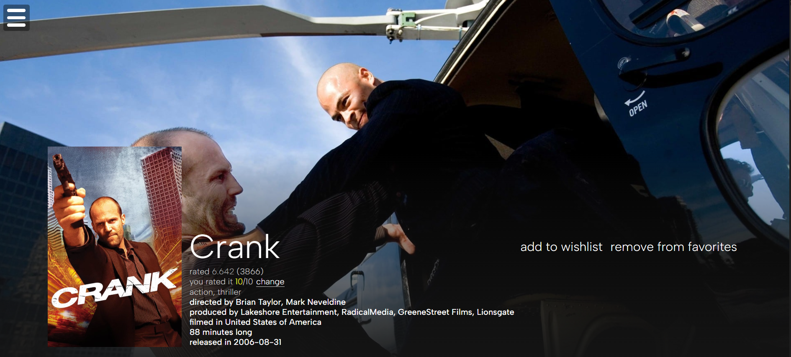
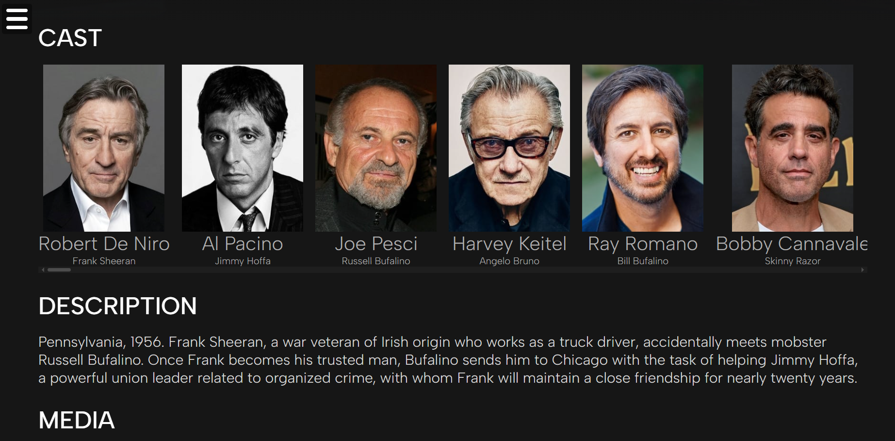
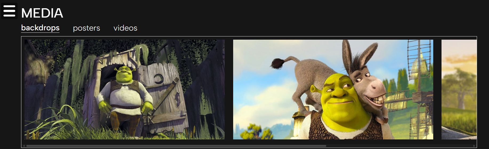
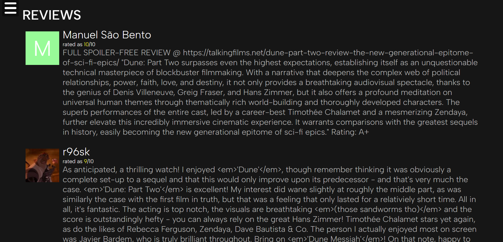
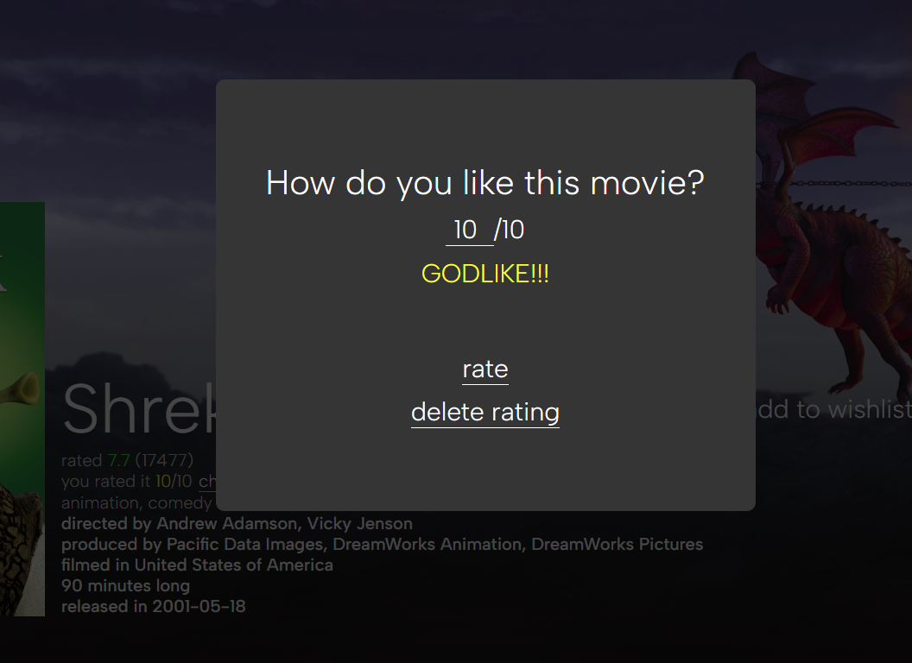
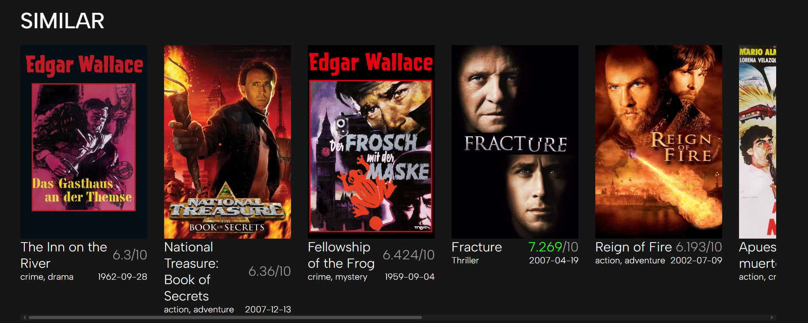
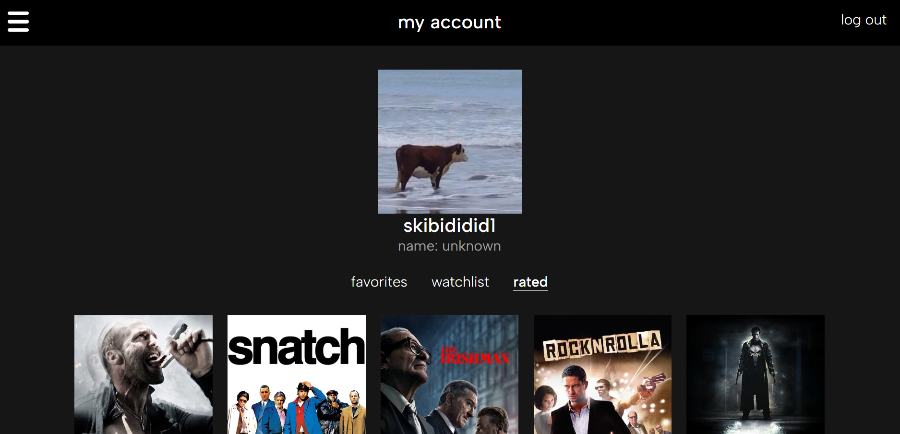
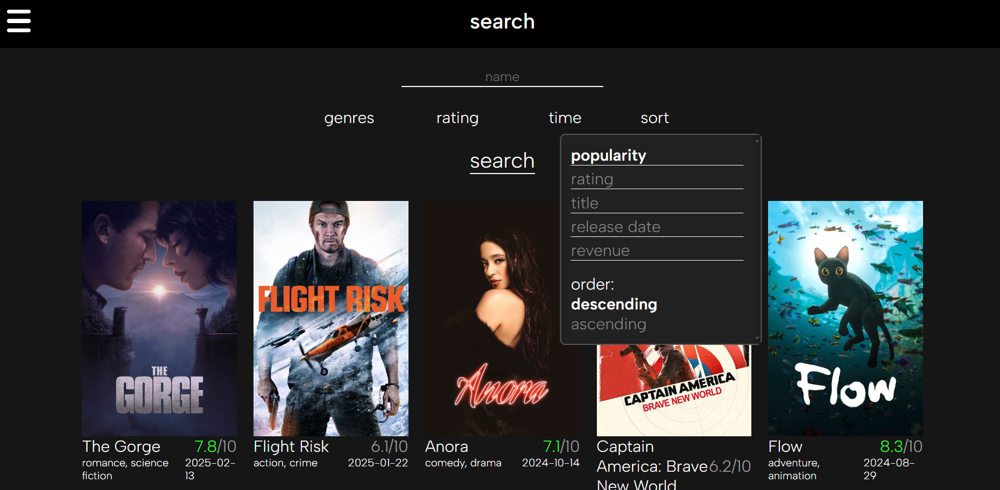

# CINEMADDICTED

A website that allows you to discover new films to watch! Uses TMDB API (might require VPN for some regions like Russia). You can rate films, add them to your favorites list and watchlist, look at the media related to a film and all other stuff... i guess. Kinda proud of it?
## Screenshots:









## commit 4
Here comes the update! Kinda big one
- Added correct genre names
- Discover page added with working filtration and search!
- added "no image found" in case if movie poster doesn't exist
- replaced seal pic (rip)

## commit 3
Small update
- Pagination in account lists, might be buggy
- Rated movies lists
- Ratings are now removable
- Temp search page (uses id input lol)

keep flowers send a hunnid thousand!

## commit 2
Big update! So
- TMDB API is now put to use
- TMDB authorization
- Movie page is functional for any movie id, which means we got:
    - Backdrops and posters (no videos yet)
    - Reviews from TMDB users
    - Watchlist and favorite buttons are now functional
    - Actor list
    - Fully functional rating (you can give different rating to a movie, but not a review)
    - Similar movies section
- Watchlist and favorite lists, you can add and remove 
There's still some minor stuff to do regarding both movie page and movie lists... But hey, it w o r k s ???? 
### Because there's no proper "discover" page, you need to type "/movie/[insert_your_movie_id]" to see a movie page. yyyah
Available paths:
- Welcome page (path '/')
- Movie page (path '/movie/[insert_your_movie_id]')
- Non-functional movie search list (path '/list/')
- Account page (path '/account/')
- Authorization page (paths '/gototmdb' and 'successtmdb')
- Temp search page (path '/tempsearch')

## commit 1
Nothing really works, API isn't used yet, all there is is some non-functional unfinished pages, which are:
- Welcome page (path '/')
- Movie page (path '/movie/')
- Movie search list (path '/list/')
- Register and login pages (paths '/register/' and '/login')

## What's next?
- Figure out how to do TV pages with less codes bruhhhh
- Code cleanup
- Don't die

## How to launch?
uhh... Run these commands in your console
```
npm install
npm run dev
```
After that you'll see a message with a localhost link. Just visit this link on your website
